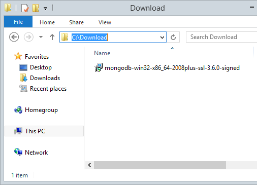
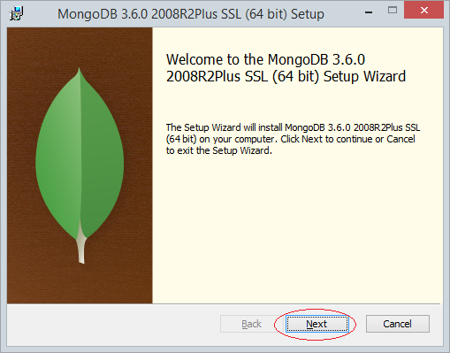
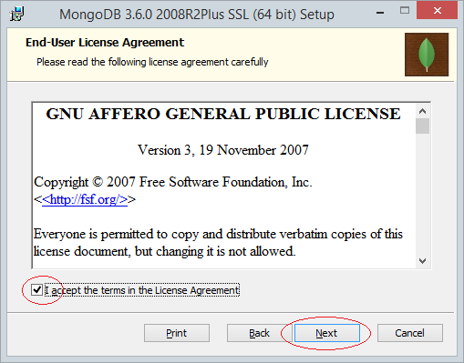
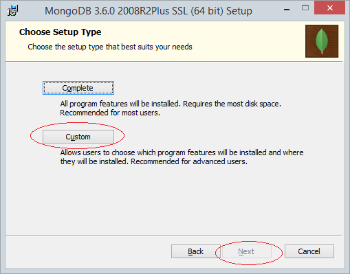
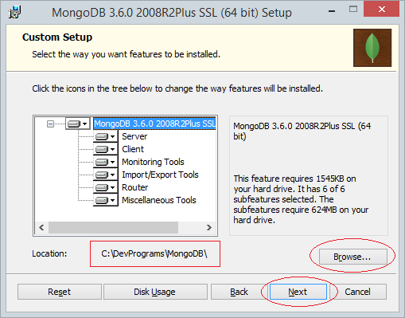
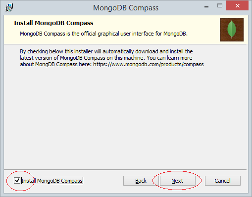
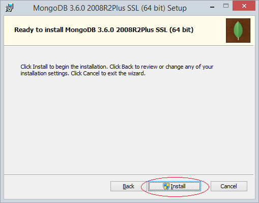
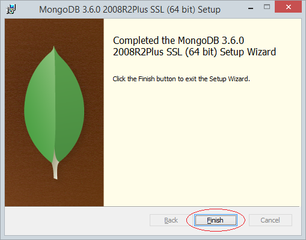

# Introduction	
MongoDB est un système de gestion de bases de données ou [SGBD](https://sql.sh/sgbd) open source dévéloppé par [MongoDB Inc](https://www.mongodb.com/company) depuis 2007,il est comme [Mysql](https://www.mysql.com/fr/) ou [PostgreSql](https://www.postgresql.org/), mais dont le mécanisme est complètement différent.
Il fait parti de la mouvance NoSQL. Son nom vient de l'anglais "humongus" qui peut être traduit par "énorme". L'objectif est donc de pouvoir gérer de très grandes quantité de données.
Fini le temps ou il fallait créer un schéma de tables relationnelles et créer des requêtes Sql complexes. Grâce à MongoDB vous allez pouvoir stocker vos données un peu comme vous le feriez dans un fichier [JSON](https://fr.wikipedia.org/wiki/JavaScript_Object_Notation). C'est à dire, une sorte de dictionnaire géant composé de clés et de valeurs. Ces données peuvent ensuite être exploitées par du [javascript](http://glossaire.infowebmaster.fr/javascript/), directement intégré dans MongoDB  

# Pourquoi préférer MongoDB à MySQL?
Les bases de données comme MongoDB sont excellentes lorsque vous connaissez généralement vos données (par opposition à la nécessité d'écrire plusieurs requêtes compliquées). Avec Mongo, les données "liées" sont soit imbriqué dans les données parentales, soit elles contiennent des clés primaires / étrangères. C'est génial si, par exemple, vous avez des messages et des commentaires; En général, vous ne pourrez pas afficher de commentaires en dehors du contexte d'une publication, il est donc logique que les commentaires soient contenus dans une publication (de cette façon, vous obtenez tous les commentaires pour la publication sans avoir besoin d'interroger une table séparée). D'autre part, si vous devez utiliser des fonctions agrégées et ressentir la nécessité d'interroger des données de manière complexe qui ne peuvent être obtenue grâce à des liens intégrés ou à des relations simples à Mongo, c'est à ce moment-là qu'il est temps d'utiliser un SGBDR comme MySQL ou PostgreSQL MongoDB n'est pas destiné à remplacer SQL. Il répond simplement à différents besoins, et MongoDB et un SGBDR peuvent être utilisés conjointement. MongoDB n'est pas si nécessaire si vous n'avez pas besoin que vos données soient flexibles ou intégrées dans un document parent. Le développement avec MongoDB est très amusant car il y a beaucoup moins d'étapes dans la réalisation et la gestion d'un projet.

# Avantages

#### Partage et équilibrage de charge
Lorsque vous devez gérer des volumes de données volumineux pour gérer la distribution du trafic sur diverses machines afin de procéder à l'équilibrage de la charge, l'utilisation de MongoDB par rapport aux bases de données classiques présente un avantage considérable. Sharding est une approche unique de MongoDB, qui permet de répondre aux demandes liées à la croissance des données et permet la mise à l’échelle horizontale sur plusieurs machines afin de prendre en charge le volume croissant de données.

#### Grande flexibilité
Utiliser MongoDB est plus simple et plus polyvalent que d’autres SGBDR, car il n’a pas besoin de structure de données unifiée pour tous les objets. Cependant, pour les utilisateurs, la structure et la cohérence des données sont une bonne chose, il est donc toujours conseillé d’avoir une structure de données unifiée.

#### La vitesse
Comme les données sont stockées en un seul point, MongoDB fonctionne très vite. Par contre, cela ne fonctionne de cette manière que si toutes les données que vous manipulez sont un seul document. Lorsque vous travaillez sur des données qui sont un modèle relationnel, le traitement de requêtes indépendantes pour extraire des données peut prendre plus de temps.

# Inconvenients
#### Plus d'utilisation de la mémoire
En stockant un nom de clé pour chaque document, MongoDB a besoin d'un espace mémoire plus important. Les jointures et les requêtes lentes ne sont pas non plus possibles. Vous devrez donc peut-être également traiter une quantité non négligeable de données en double.

#### Aucune jointure
Contrairement aux bases de données relationnelles, les jointures ne sont pas possibles avec MongoDB. Si vous avez besoin de jointures, vous devez effectuer plusieurs interrogations manuellement.

#### Pas complètement développé
MongoDB est une plate-forme relativement nouvelle qui est encore en développement alors que SQL était bien établi dans les années 1980. De plus, MongoDB n’est pas suffisamment documenté et doit faire face à des problèmes de manque de soutien.


# Collection et Documents
Avant de commencer à voir en détail le fonctionnement de MongoDB, il faut comprendre différentes notions. MongoDB stocke ses données sous le même format qu'un document JSON. Pour être plus exact, c'est la version binaire du JSON appelé [BSON](https://fr.wikipedia.org/wiki/BSON). Mais alors, c'est quoi un document [JSON](https://fr.wikipedia.org/wiki/JavaScript_Object_Notation) ?

## Document 
Les documents sont les unités de base dans une base MongoDB. Ils sont équivalents aux objets JSON et sont comparables aux enregistrements d'une table dans une base de données relationnelle.

Tout document appartient à une collection et a un champ appelé _id qui identifie le document dans la base de données.

Un document [JSON](https://fr.wikipedia.org/wiki/JavaScript_Object_Notation), c'est simplement un ensemble de clés et de valeurs dont la notation est la suivante :
```
{
"first_name": "Richard",
"last_name": "Dawkins",
"job":"ethologist",
"age": 73
}
```
Dans cette exemple, first_name est la clé , Richard est la valeur.
Plusieurs documents peuvent être imbriqués ensemble pour former un documents plus complexe :
```
{
"first_name": "Richard",
"last_name": "Dawkins",
"job":"ethologist",
"age": 73   
address : {
    "street":"33 panda street",
    "city":"Oxford",
    "country":"UK"
    }
}
```
Il est également possible de mettre des listes :
```
{
"first_name": "Richard",
"last_name": "Dawkins",
"job":"ethologist",
"age": 73   
books: [
{"title": "Selfish Gene", "date":"1976"},
{"title": "The blind watchmaker", "date":"1956"},
{"title":"The magic of Reality", date:"2011", "page_count":200}
]
```
Si vous regardez la liste de livres, vous remarquerez qu'il n'est pas nécessaire de respecter la cohérence des champs d'une base Sql. En effet, il y a deux champs title et date pour les deux premiers livres, et 3 pour le dernier.


## Collection

Une collection est tous simplement un ensemble de document, l'équivalent d'une table en relationnel. Contrairement aux bases de données relationnelles, les champs des documents d'une collection sont libres et peuvent être différents d'un document à un autre. Le seul champ commun est obligatoire est le champ "_id".
. On peut la comparer à une table. Par exemple, une collection de 50 auteurs contiendra 50 documents comme défini plus haut. MongoDB intègre des index notés _id unique pour chaque document.
```
{
"_id" : 0
"first_name": "Richard",
"last_name": "Dawkins",
 },
 {
"_id" : 1
"first_name": "Stephen",
"last_name": "Jay Gould",
 },
 {
"_id" : 2
"first_name": "François",
"last_name": "Jacob",
"telehone":"0096111111",
 },
 .....
 ```
Sachez que le format JSON, provient directement du langage Javascript. D'ailleurs JSON veut dire JavaScript Object Notation. C'est pour cette raison que MongoDB utilise javascript par defaut afin de manipuler sa base.

# Premier pas avec MongoDB
## Installation
si vous êtes sous windows vous pouvez télécharger un file msi depuis ce lien [https://www.mongodb.com/download-center/community](https://www.mongodb.com/download-center/community), et suivre les etapes suivantes:

**-  installation sous windows**

**1. **
[](https://louayayoub.github.io/C1/images/1.png "1-")

**2. **
[](https://louayayoub.github.io/C1/images/2.png "2-")

**3. **
[](https://louayayoub.github.io/C1/images/2.png "3-")

**4. ** 
[](https://louayayoub.github.io/C1/images/4.png "4-")

**5. **
[](https://louayayoub.github.io/C1/images/5.png "5-")

**6. **
[](https://louayayoub.github.io/C1/images/6.png "6-")

**7. **
[](https://louayayoub.github.io/C1/images/7.png "7-")

**8. **
[](https://louayayoub.github.io/C1/images/2.png "8-")


**-  installation sous Linux**

Si vous utilisez Linux Ubuntu, vous pouvez facilement l'installer par ce commande: 
```sudo apt-get install MongoDB```

## Lancement du serveur
Sous linux, un daemon est automatiquement crée. Pour l’exécuter :
```sudo /etc/init.d/mongod stop```
Pour les autres, il suffit d’exécuter __mongod__ en spécifiant un chemin de stockage:
```mongod --dbpath C:/mongodata```

## Connecter au serveur
Exécuter le client **mongo** depuis votre terminal. Par défaut, il se connecte au serveur **mongod** en localhost sur le port 27017

```
Microsoft Windows [Version 10.0.17763.316]
(c) 2018 Microsoft Corporation. All rights reserved.

C:\Users\Louay>mongo
MongoDB shell version v4.0.6
connecting to: mongodb://127.0.0.1:27017/?gssapiServiceName=mongodb
Implicit session: session { "id" : UUID("ed633c7f-7de5-461f-8999-d89f52087eb9") }
MongoDB server version: 4.0.6
Server has startup warnings:
2019-02-24T15:10:15.633+0200 I CONTROL  [initandlisten]
2019-02-24T15:10:15.633+0200 I CONTROL  [initandlisten] ** WARNING: Access control is not enabled for the database.
2019-02-24T15:10:15.633+0200 I CONTROL  [initandlisten] **          Read and write access to data and configuration is unrestricted.
2019-02-24T15:10:15.634+0200 I CONTROL  [initandlisten]
---
Enable MongoDB  free cloud-based monitoring service, which will then receive and display
metrics about your deployment (disk utilization, CPU, operation statistics, etc).

The monitoring data will be available on a MongoDB website with a unique URL accessible to you
and anyone you share the URL with. MongoDB may use this information to make product
improvements and to suggest MongoDB products and deployment options to you.

To enable free monitoring, run the following command: db.enableFreeMonitoring()
To permanently disable this reminder, run the following command: db.disableFreeMonitoring()
---
>
```
## Afficher les bases de données
Pour afficher les bases de données disponibles, utilisez **show dbs**. Normalement vous devriez avoir une base local propre à mongo et une base test:

```
> show dbs
admin   0.000GB
config  0.000GB
local   0.000GB

```
## Création d'une base de donnée
Pour continuer ce tutoriel, je veux créer une base de donnée **medical** , et créer une collection de **patients**. Chaque patient sera défini par son **nom**, **prenom** et sa **date de naissance**. Pour créer notre première base de données :

    > use medical
    switched to db medical

Vous pouvez faire **db** pour voir la base de donnée courante. Attention, si vous faites **show dbs**, vous ne verrez pas encore votre base. En effet, mongo attend d'avoir du contenu pour créer votre base.

## Insertion
Pour créer une collection, il suffit simplement d'ajouter un patient. Par exemple pour:


    {
        "nom":"Toto"
        "prenom":"Toto"
        "ddn":Date('oct 7, 1993')
    }

Je fais simplement :

    db.patients.insert({"nom":"Toto", "prenom":"Toto", "ddn":new Date('oct 7, 1993')})

La collection patients se crée automatiquement lors de la première utilisation. Si vous faite maintenant :
- **db.patients.find()**


      > db.patients.find()
        { "_id" : ObjectId("5c72ca25ac3f9dbc6aa2ea46"), "nom" : "Toto", "prenom" : "Toto", "ddn" : ISODate("1993-10-06T21:00:00Z") }
    
Vous pouvez voir le document que vous venez d'ajouter.
***Notez***  que MongoDB ajoute automatiquement un **_id** si rien n'est spécifié.

En guise d'exemple, on va remplir notre collections en répétant cette procédure 50 fois.


    > for ( var i = 0 ; i<50; i++){ db.patients.insert({"nom":"Toto" , "prenom":"Toto", "age": i})     }
    WriteResult({ "nInserted" : 1 })

Vérifions le nombre de patients :


     > db.patients.count()
        51


## Lister la collection
### find(critère, projection)
- Utiliser find() pour retourner toute la liste de la collection patients.
        db.patients.find()
- Pour récupérer les patients dont l'age = 5
  
        db.patients.find({age:5})
- On peut aussi utiliser des expressions régulières. Par exemple, tous les prénoms commençant par "T"
  
        db.patients.find({prenom: /^T*/})
- Pour récupérer les patients dont l'age est supérieur à 40
  
         db.patients.find({age:{>40}})

- Pour récupérer les patients dont l'âge est 5 ou 10 :

       db.patients.find({age:{$in:[5,10]}})

- Pour récupérer uniquement certaine clé, on utilise l'argument projection de find(). Par exemple, récupérer uniquement les noms des patients dont l'âge est supérieur à 40

        db.patients.find({age:{>40}},{"nom":true})

- Pour limiter le nombre de résultat à 3 :

        db.patients.find().limit(3)

- Pour ordonner la liste par âge décroissant. -1 pour décroissant et 1 pour croissant.

        db.patients.find().sort(age:-1)

## Modifier la collection
### update(query, update, options)
- Remplacer tous les prénoms Toto par boby

        db.patients.update({"prenom":"Toto"},{$set:{"prenom":"boby"}},{multi:true})

- Ajoute une clé sexe à tous les patients

        db.patients.update({prenom:"boby"}, {$set:{sexe:"male"}}, {multi:true})

- Ajoute un patient olivier s'il n'existe pas
        db.patients.update({prenom:"olivier"}, {$set:{sexe:"male"}}, {upsert:true})

### save(document, writeConcern)
La différence avec insert est que save, fait un update du document s'il existe déjà.
    
    db.patient.save({"prenom":"Toto", "nom":"Van Damme"})

## Suppression
### remove(query,justOne)
- Supprimer tous les patients qui s'appellent olivier

        db.patients.remove({prenom:"olivier"})

- Supprimer la collection
        db.patients.drop()

- Supprimer la base de donnée

        use medical
         db.runCommand({dropDatabase: 1})
